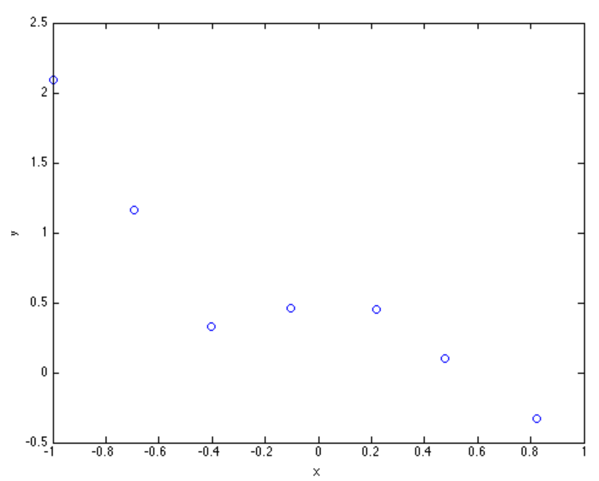

# Machine Learning
## Linear Regression
### 1. Linear Regression with One Variable
In this exercise, we have one variable, X, and we building a model to predict one output, Y.  

The main program will be run from mllab1.m. Your first task is to run the main file.  

You will see a graph open displaying the changing gradient of your hypothesis. When gradient descent has finished press “enter” to load the graph displaying the cost obtained with the theta values used at each iteration. Both the hypothesis and the cost graph will be flat because we need to calculate our hypothesis. For one variable linear regression, the hypothesis function is:  

=\theta_0x_0&plus;\theta_1x_1$$)  

where x0 is the bias term and is set to 1 for all training examples.  

**Task 1** Modify the function calculate_hypothesis.m to return the predicted value for a single specified training example.  
Include in the report the corresponding lines from your code.  
For example, if the first training example is [1,5] corresponding to [x0, x1], return,  
=\theta_01&plus;\theta_15)  

When this is completed, run mllab1.m again and you should see the gradient of the hypothesis better fit the model and the cost going down over time. Notice that the hypothesis function is not being used in the gradient_descent function. Modify it to use the calculate_hypothesis function. Include the corresponding lines of the code in your report.  

Now modify the values for the learning rate, alpha in mllab1.m.  

Observe what happens when you use a very high or very low learning rate. Document and comment on your findings in the report.  

### 2. Linear Regression with Multiple Variables

Create a new folder and copy all the files in the new one and start running the programs according to the steps below. In this part, we will be using mllab2.m  

We will now look at linear regression with two variables (three including the bias). The hypothesis function now looks like this:  
=\theta_0x_0&plus;\theta_1x_1&plus;\theta_2x_2)  

In this exercise, we are looking at house price data. x0 corresponds to the bias, that is it set to 1, x1 is the area of the house in square feet and x2 corresponds to the number of bedrooms. If you open ex1data2.txt you will see there is a large difference between the values of x1 and x2.  

In order to bring the two features into a similar range, X is normalized using the normalise_features method.  

**Task 2** Modify the functions calculate_hypothesis and gradient_descent to support the new hypothesis function. This should be sufficiently general so that we can have any number of extra variables. Include the relevant lines of the code in your report.  

Run mllab2.m and see how different values of alpha affect the convergence of the algorithm. Print the theta values found at the end of the optimization. Include the values of theta and your observations in your report.  

Finally, we would like to use our trained theta values to make a prediction. Add some lines of code in mllab2.m to make predictions of house prices.  

How much does your algorithm predicts that a house with 1650 sq. ft. and 3 bedrooms cost?  

How about 3000 sq. ft. and 4 bedrooms?  

To make a prediction you will need to normalize the two variables using the saved values for mean and standard deviation.  

Remember that these are different for the two variables. The formula used for normalization is:  

  

Add the lines of the code that you wrote in your report. Include as well the predictions that you make for the prices of the houses above.  

## 3. Regularized Linear Regression

Create a new folder and copy all the files in the new one and start running the programs according to the steps below. In this part, we will be using mllab3.m  

In this exercise, we will be trying to create a model that fits data that is clearly not linear. We will be attempting to fit the data points seen in the graph below:  

  

In order to fit this data we will create a new hypothesis function, which uses a fifth-order polynomial:  

=\theta_0x_0&plus;\theta_1x_1&plus;\theta_2x_1^2&plus;\theta_3x_1^3&plus;\theta_4x_1^4&plus;\theta_5x_1^5)

We will be fitting the following data:

  

As we are fitting a small number of points with a high order model, there is a danger of over fitting.  

To attempt to avoid this we will use regularization. Our cost function becomes:  

=\frac{1}{2m}[\sum^m_{i=1}(h\theta(x^{(i)})-y^{(i)})^2-\lambda\sum^n_{j=1}\theta_j])  

**Task 3** Note that the punishment for having more terms is not applied to the bias. This cost function has been implemented already in the function compute_cost_regularised. Modify gradient_descent to use the compute_cost_regularised method instead of compute_cost. Include the relevant lines of the code in your report and a brief explanation.  

Next, modify gradient_descent to incorporate the new cost function. Again, we do not want to punish the bias term. This means that we use a different update technique for the partial derivative of 𝜃0, and add the regularization to all of the others:  

})-y^{(i)})x_0^{(i)})  
-\alpha\frac{1}{m}\sum^m_{i=1}(h_\theta(x^{(i)})-y^{(i)})x_j^{(i)})  

Include the relevant lines of the code in your report.  

After gradient_descent has been updated, run mllab3.m. This will plot the hypothesis function found at the end of the optimization.  

First of all, find the best value of alpha to use in order to optimize best. Report the value of alpha that you found in your report.  

Next, experiment with different values of 𝜆 and see how this affects the shape of the hypothesis. Note that gradient_descent will have to be modified to take an extra parameter, l (which represents 𝜆). Include in your report the plots for a few different values of 𝜆 and comment.  

